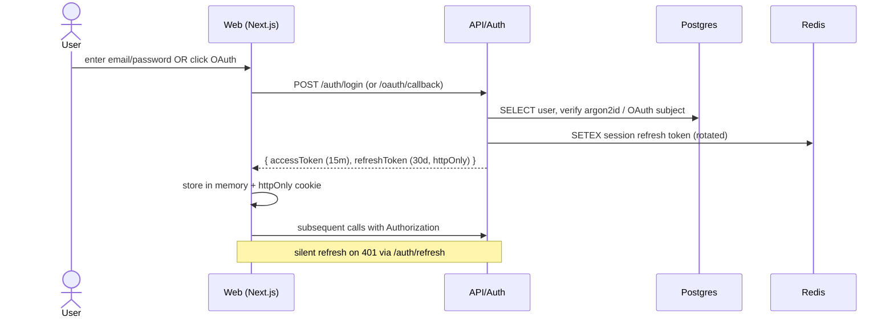
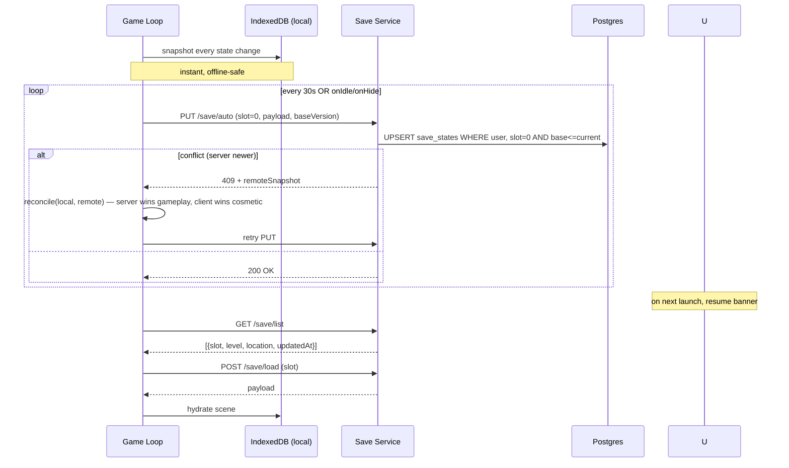
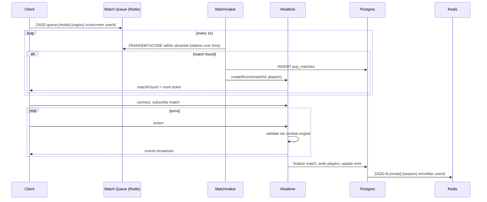
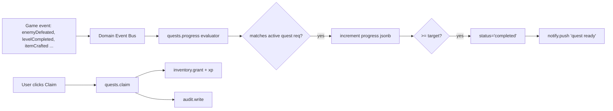
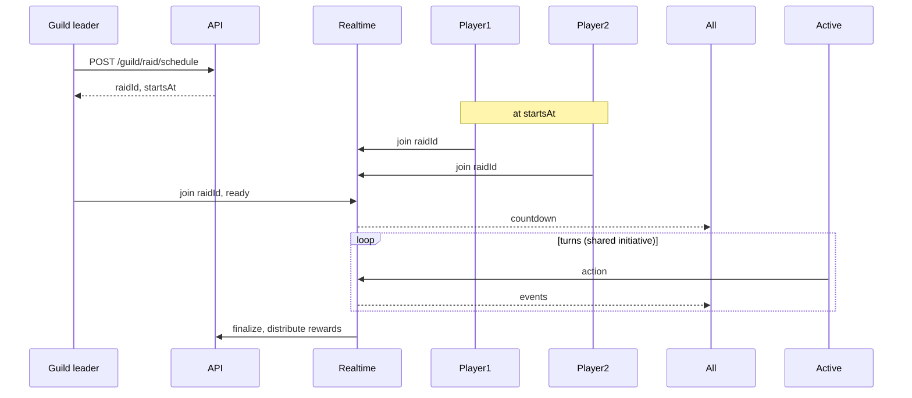
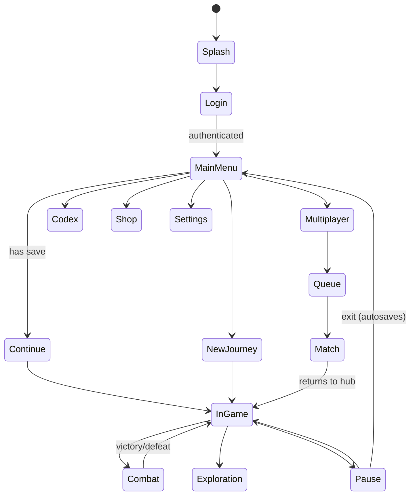

# AETHERIA — Key Flows (Data, Level-Up, Business)
*Step 2 · sequence + state diagrams · Mermaid blocks render in GitHub & VSCode*

## 1. Auth Flow (email + OAuth)


## 2. Save / Resume Flow (autosave + cloud-sync)


## 3. Combat Turn Flow
```mermaid
sequenceDiagram
  participant C as Client
  participant API as API
  participant E as combat.applyAction (pure)
  participant DB as Postgres
  C->>API: action {runId, actor, type, target}
  API->>DB: SELECT run state + lastSeq
  API->>E: applyAction(state, action)
  E-->>API: {nextState, events[]}
  API->>DB: APPEND action_log, UPDATE snapshot
  API-->>C: {events[], stateChecksum, seq+1}
  C->>C: animate events; reconcile if checksum mismatch (rare)
  Note over API: server is authoritative — client cannot cheat
```

## 4. Level-Up Flow (character & account)
```mermaid
flowchart TD
  Start[Action grants XP] --> A[progression.grantXp]
  A --> B{xp >= curveAt(level+1)?}
  B -- no --> persist[(persist xp)]
  B -- yes --> Loop[loop levels gained]
  Loop --> C[stats += growthCurve]
  Loop --> D[unlock next skill node?]
  Loop --> E[milestone reached? lvl%5==0]
  E -- yes --> M[grant milestone reward]
  Loop --> F[emit LeveledUp event]
  F --> Q[quests.progress on event]
  F --> N[notify.push]
  F --> persist
```
Curve: `xp(n) = floor(50 * n^1.85)`; max char level = 100.
Milestone unlocks (account level):
- 5 → Photo Mode
- 10 → second character slot
- 15 → daily quests
- 25 → co-op raids
- 40 → ranked PvP
- 60 → guild creation
- 80 → endless tower
- 100 → epilogue + new+ mode

## 5. Matchmaking & Ranking Flow

MMR algorithm: Glicko-2 (rating, deviation, volatility).

## 6. Quest Progress Flow (event-driven)


## 7. Guild Raid Flow (3-player co-op)


## 8. Marketplace Purchase Flow
```mermaid
sequenceDiagram
  C->>API: POST /shop/purchase (shopItemId, qty)
  API->>DB: BEGIN
  API->>DB: SELECT FOR UPDATE shop_items, profile.currency
  API->>DB: validate price, stock, currency
  API->>DB: INSERT transactions; UPDATE currency; INSERT inventory
  API->>DB: COMMIT
  API->>Audit: write transaction
  API-->>C: success + new balances
```

## 9. Anti-Cheat / Replay Validation
```mermaid
flowchart TD
  Run[Run completed] --> AC[worker.antiCheatScan]
  AC --> Replay[combat.replayActions(action_log)]
  Replay --> Check{state matches snapshot?}
  Check -- no --> Flag[mark suspicious, audit, throttle account]
  Check -- yes --> OK[clear]
```

## 10. Game State Machine (top-level)

